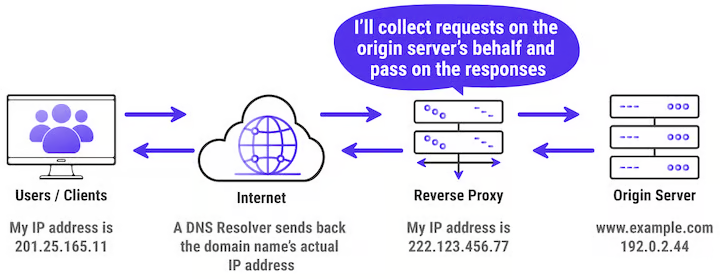

# Deploying a Spring App with Nginx and with/without Docker


Spring Boot is a powerful, feature-rich framework for building Java-based web applications and microservices. It simplifies the development process by providing a comprehensive suite of tools and default configurations, allowing developers to focus more on writing business logic rather than dealing with infrastructure and boilerplate code.

Key features of Spring Boot include:

- **Auto-Configuration:** Automatically configures Spring applications based on the dependencies you have included, minimizing the need for explicit XML configuration.
- **Embedded Servers:** Spring Boot comes with embedded web servers like Tomcat, Jetty, and Undertow, allowing you to run applications as standalone executables without requiring a separate application server.
- **Production-Ready:** Provides features such as metrics, health checks, and externalized configuration to help you monitor and manage your application in production environments.
- **Microservices Support:** Spring Boot is well-suited for building microservices architectures, providing tools and conventions that simplify the creation and deployment of microservices.
- **Spring Ecosystem Integration:** Seamlessly integrates with other projects in the Spring ecosystem, such as Spring Data, Spring Security, and Spring Cloud, to offer a cohesive and comprehensive development experience.


> Note: Before starting this lab, ensure you have completed the following prerequisites:
> - Setting up the client-server environment as described in the [Environment Setup](../../Prerequisites.md) section. Proper DNS configuration and hostname setup are essential for the exercises in this lab.
> - Installing Nginx as outlined in the [Nginx Installation Guide](../../nginx/README.md).
> - Alternatively, if you prefer to use Docker, make sure Docker is installed and running on your server. You can refer to the [Docker Installation Guide](../../../docker/README.md) for detailed instructions.


In this lab, we will learn how to deploy a Spring App on an Ubuntu server using Nginx. We will cover how to transfer your project to the server using SCP or a GitHub repository.For this lab, we will use the subdomain spring.server.io and a demo project named [spring.jar](spring.jar) is attached in the same directory as this lab for your convenience.


## Deploying a Spring App Using Nginx without Docker

### Step 1: Create the Website Folder

#### Connect to the Server:

1. Open a terminal on your local machine.

2. Use SSH to connect to your Ubuntu server. Replace <user> and <server-ip> with your server’s username and IP address:

```bash
ssh <user>@<server-ip>
```

Example:

```bash
ssh serverio@192.168.1.10
```
#### Create the Website Folder:
1. Create a new directory for your project:

```bash
sudo mkdir -p /workdir/spring.server.io

sudo chown -R $USER:$USER /workdir/spring.server.io
sudo chmod -R 755 /workdir/spring.server.io

cd /workdir/spring.server.io
```

### Step 2: Transfer the Spring App Files
You can transfer your Spring App files to the server using SCP or by cloning a GitHub repository.

#### Using SCP:

1. Open a terminal on your local machine.

2. Use the scp command to transfer the files. Replace <local-path> with the path to your project directory and <user> and <server-ip> with your server's username and IP address:

```bash
scp -r <local-path> <user>@<server-ip>:/workdir/spring.server.io
```
Example:

```bash
scp -r ./spring.jar serverio@192.168.1.10:/workdir/spring.server.io
```

#### Using GitHub:

1. Navigate to the web root directory:

```bash
cd /workdir/spring.server.io
```
2. Clone your repository:
```bash
git clone https://github.com/yourusername/spring-website.git spring-website
```

### Step 3: Install Java
#### Install JAVA using OpenJDK
OpenJDK provides all the tools you need to develop Java-based applications and microservices, including the Java compiler, Java Runtime Environment (JRE), and Java class library.

Ubuntu repositories provide the OpenJDK package by default, and you can search for its availability as shown.

```bash
sudo apt-cache search openjdk
```

At the time of writing, the most recent release is OpenJDK 20. The latest LTS ( Long Term Support ) release is OpenJDK 17 and will be supported until 30 September 2026.

To install OpenJDK 11 using the APT package manager, execute the command:

```bash
sudo apt install openjdk-17-jdk -y
```

#### Configure Default Java Version on Ubuntu
You can have multiple installations of Java on your system without much of an issue. However, you might be required to set a certain installation of Java as the default version based on your project’s requirements.

You can accomplish this with the update-alternatives command-line utility, which allows you to list and set the default version of Java on your system.

To configure the default Java version, run the command:

```bash
sudo update-alternatives --config java
```

The command lists all the currently installed versions of Java and their installation paths. The default version is prefixed with an asterisk ( * ) in the ‘Selection’ column. You can choose to keep the current selection as the default version by pressing ‘ENTER’ or change the default version by typing a selection number of your preferred Java installation and pressing ‘ENTER’.

In the example below, we have selected to configure OpenJDK 11 as the default Java version.

You can later verify this by checking the version of Java.

```bash
java -version
```

### Step 4: Configure Nginx

1. Create a new Nginx configuration file for your Spring App :

```bash
sudo nano /etc/nginx/sites-available/spring.server.io
```

2. Add the following configuration to the file:

```nginx
server {
    listen 80;
    server_name spring.server.io www.spring.server.io;

    location / {
        proxy_pass http://localhost:8080;
        proxy_set_header Host $host;
        proxy_set_header X-Real-IP $remote_addr;
        proxy_set_header X-Forwarded-For $proxy_add_x_forwarded_for;
        proxy_set_header X-Forwarded-Proto $scheme;
    }

    # Define access log and error log locations
    access_log /var/log/nginx/spring-app-proxy.access.log;
    error_log /var/log/nginx/spring-app-proxy.error.log;
}
```

### Nginx Configuration for Spring Boot Application

This Nginx configuration file sets up a server to handle HTTP requests for a Spring Boot application hosted under the `spring.server.io` domain. The Nginx server acts as a reverse proxy, forwarding incoming requests to the Spring Boot application running on localhost at port 8080.

**Configuration Breakdown**

- **Server Block:**
    - `listen 80;`
      - The server listens on port 80, which is the default port for HTTP traffic.
    - `server_name spring.server.io www.spring.server.io;`
      - The server responds to requests for the domain names `spring.server.io` and `www.spring.server.io`.

- **Location Block:**
    - `location / { ... }`
      - Defines how requests to the root URL and its subpaths should be handled.

- **Proxy Settings:**
    - `proxy_pass http://localhost:8080;`
      - Forwards all incoming requests to the Spring Boot application running on localhost at port 8080.
    - `proxy_set_header Host $host;`
      - Sets the `Host` header in the forwarded request to the value of the original request's host header.
    - `proxy_set_header X-Real-IP $remote_addr;`
      - Sets the `X-Real-IP` header to the client’s IP address.
    - `proxy_set_header X-Forwarded-For $proxy_add_x_forwarded_for;`
      - Sets the `X-Forwarded-For` header to include the client’s IP address. This header helps in tracking the original client's IP address when requests are forwarded through proxies.
    - `proxy_set_header X-Forwarded-Proto $scheme;`
      - Sets the `X-Forwarded-Proto` header to the scheme (HTTP or HTTPS) used in the original request. This is useful for applications that need to know the protocol used by the client.

- **Log Configuration:**
    - `access_log /var/log/nginx/spring-app-proxy.access.log;`
      - Specifies the location of the access log file, which records details about each request handled by the server.
    - `error_log /var/log/nginx/spring-app-proxy.error.log;`
      - Specifies the location of the error log file, which records any errors encountered while processing requests.

3. Enable the configuration by creating a symbolic link to the sites-enabled directory:

```bash
sudo ln -s /etc/nginx/sites-available/spring.server.io /etc/nginx/sites-enabled/
```

4. Test the Nginx configuration for syntax errors:

```bash
sudo nginx -t
```
5. Reload Nginx to apply the changes:

```bash
sudo systemctl reload nginx
```

### Step 5: Creating an Init Script for the Spring Boot Application
To access the new application externally across the internet, a few more steps are required. An init script for the Spring Boot application must be created inside the systemd server. This registers Spring Boot as a service and launches it at system start-up time.

1. Create a service script for spring.server.io.service in the /etc/systemd/system directory as follows. The ExecStart field must contain the full path to the application .jar file. This is the same file that ran inside Tomcat server earlier. For the path name, replace userdir with the name of the user directory.

```bash
sudo nano  /etc/systemd/system/spring.server.io.service
```
```bash
[Unit]
Description=Spring.server.io
After=syslog.target
After=network.target[Service]
User=username
Type=simple

[Service]
ExecStart=/usr/bin/java -jar /workdir/spring.server.io/spring.jar
Restart=always
StandardOutput=syslog
StandardError=syslog
SyslogIdentifier=/workdir/spring.server.io

[Install]
WantedBy=multi-user.target
```

2. Start the service.
```bash
sudo systemctl start spring.server.io
```

3. Verify the service is active.
```bash
sudo systemctl status spring.server.io
```

### Step 6: Verify the Deployment
Open a web browser on your client machine.
Navigate to http://spring.server.io to see your deployed Spring App.


## Deploying a Spring App Using Nginx with Docker

### Step 1: Make Docker image
1. Inside the working  directory (`/workdir/spring.server.io`), create a `Dockerfile` with the following content:

```Dockerfile
FROM openjdk:17-jdk-alpine as builder

# Set working directory
WORKDIR /app

# Copy JAR file (replace "spring.jar" with your actual file name)
COPY spring.jar app.jar

# Expose port (replace 8080 with your application port)
EXPOSE 8080

# Entrypoint to run the application
ENTRYPOINT ["java", "-jar", "app.jar"]
```


**Explanation:**

> Line 1-4: The first stage (builder) uses the openjdk:17-jdk-alpine image, sets the working directory to /app, copies your Spring Boot application JAR file (replace "spring.jar" with the actual filename) and renames it to app.jar, and defines the build environment.

> Line 5-7: The final stage inherits from a slimmer openjdk:17-jre-alpine image, exposes the container port (usually 8080 for Spring Boot apps), and defines the ENTRYPOINT command to run java -jar app.jar, launching your application at runtime.


## Step 2: Build and Run the Docker Container

1. Build the Docker image:
```bash
sudo docker build -t spring.server.io .
```

2. Run the Docker container:
```bash
sudo docker run -d -p 8080:8080 --name spring.server.io-container spring.server.io
```
- This command maps port 8080 on your server to port 8080 in the container.

## Step 3: Configure Nginx as a Reverse Proxy



1. On your server, edit the Nginx configuration file to set up a reverse proxy. Open the configuration file:
```bash
sudo nano /etc/nginx/sites-available/spring-site-proxy
```

2. Add the following configuration:
```nginx
server {
    listen 80;
    server_name spring.server.io www.spring.server.io;

    location / {
        proxy_pass http://localhost:8080;
        proxy_set_header Host $host;
        proxy_set_header X-Real-IP $remote_addr;
        proxy_set_header X-Forwarded-For $proxy_add_x_forwarded_for;
        proxy_set_header X-Forwarded-Proto $scheme;
    }

    # Define access log and error log locations
    access_log /var/log/nginx/spring-site-proxy.access.log;
    error_log /var/log/nginx/spring-site-proxy.error.log;
}
```

**Explanation of the Nginx Server Configuration**

This Nginx configuration sets up a server to handle HTTP requests and proxy them to a Docker container running on port 8080. Here’s a detailed breakdown of the configuration:

- **Server Block:**
   - The `server` block defines the configuration for handling requests to your server.

- **Listening Port:**
   - `listen 80;`
   - Specifies that the server will listen on port 80, the default port for HTTP traffic.

- **Server Name:**
   - `server_name spring.server.io www.spring.server.io;`
   - Defines the domain names that this server block should respond to. Here, it will respond to requests for `spring.server.io` and `www.spring.server.io`.

- **Location Block:**
   - `location / { ... }`
   - The `location /` block defines how to handle requests for the root URL and its subpaths.

- **Proxy Pass:**
   - `proxy_pass http://localhost:8080;`
   - This directive passes requests from Nginx to the backend server running on `http://localhost:8080`. In this case, it's the Docker container serving the spring app.

- **Proxy Headers:**
   - `proxy_set_header Host $host;`
     - Sets the `Host` header in the proxied request to the original host requested by the client.
   - `proxy_set_header X-Real-IP $remote_addr;`
     - Sets the `X-Real-IP` header in the proxied request to the IP address of the client making the request.
   - `proxy_set_header X-Forwarded-For $proxy_add_x_forwarded_for;`
     - Adds the client’s IP address to the `X-Forwarded-For` header, which is a standard header used for identifying the originating IP address of a client connecting to a web server through an HTTP proxy or load balancer.
   - `proxy_set_header X-Forwarded-Proto $scheme;`
     - Sets the `X-Forwarded-Proto` header to the scheme (HTTP or HTTPS) used by the client to connect to the server.

- **Access Log:**
   - `access_log /var/log/nginx/spring-site-proxy.access.log;`
   - Defines the location of the access log file, where Nginx will log details of every request processed by this server block.

- **Error Log:**
   - `error_log /var/log/nginx/spring-site-proxy.error.log;`
   - Specifies the location of the error log file, where Nginx will log errors encountered while processing requests.

3. Enable the configuration by creating a symbolic link to the `sites-enabled` directory:
```bash
sudo ln -s /etc/nginx/sites-available/spring-site-proxy /etc/nginx/sites-enabled/
```

4. Test the Nginx configuration for syntax errors:
```bash
sudo nginx -t
```

5. Reload Nginx to apply the changes:
```bash
sudo systemctl reload nginx
```

## Step 4: Verify the Deployment

1. Open a web browser on your client machine.
2. Navigate to `http://spring.server.io` to see your deployed spring app served through Nginx and Docker.