# Installing and Configuring vCenter Server Appliance

## Objective

In this lab, you will learn how to deploy and configure the vCenter Server Appliance using the Installer Method. By the end of this lab, you will have a functioning vCenter Server in your virtualized environment.

---

## Prerequisites (Reminder)

Ensure you meet the following requirements before starting:

1. **VMware ESXi Host**: Version 6.5 or higher.
2. **Network Configuration**: Ensure DNS and NTP servers are configured.
3. **System Requirements**:

   | Component             | Minimum Requirement                 |
   |-----------------------|-------------------------------------|
   | **CPU**               | 2 vCPUs                             |
   | **Memory**            | 12 GB RAM                           |
   | **Disk Space**        | 250 GB (based on deployment size)   |

---

---

## Installation Methods Overview

There are several methods available to deploy the vCenter Server Appliance. Choose the one that best fits your environment and requirements:

1. **Installer Method**: Uses a GUI-based installer available on Windows, Mac, and Linux. This is the method we'll use in this lab.
2. **CLI Deployment**: Allows for automated deployments using a JSON configuration file, which is useful for scripting and large-scale environments.
3. **vSphere Lifecycle Manager**: This method integrates with vSphere Update Manager for streamlined upgrades and deployment within an existing VMware environment.
4. **Direct ESXi Console (OVF/OVA)**: Deploys the vCenter Appliance using an OVF or OVA file directly from the ESXi host, offering a manual option for more control.

> **Note**: In this lab, we’ll focus on the **Installer Method** as it’s the most user-friendly and provides a straightforward GUI for setup.

---

## Step-by-Step Lab Instructions

### Step 1: Download the vCenter Server Appliance ISO

1. Visit VMware's official website and download the vCenter Server Appliance ISO.
2. Mount the ISO on your workstation to access the installer.

### Step 2: Launch the vCenter Installer

1. Open the mounted ISO and navigate to the `vcsa-ui-installer` folder.
2. Open the folder for your operating system (`win32` for Windows) and run **installer.exe**.
3. In the Installer window, select **Install** to begin.

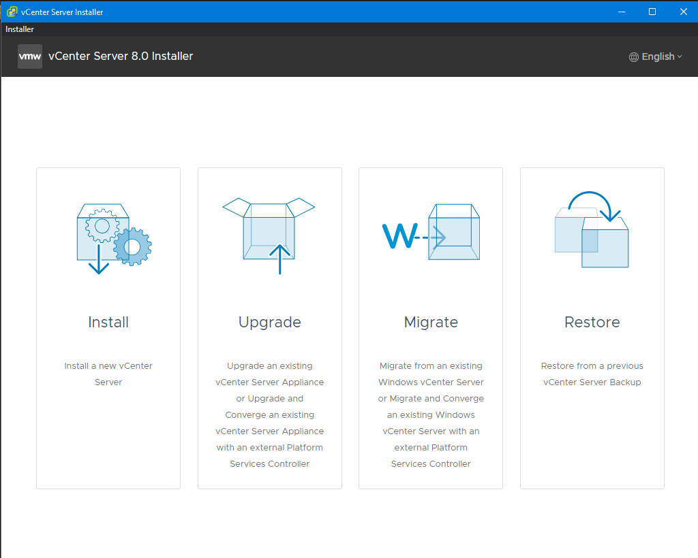

#### Introduction to vCenter Server Installation

The installation of vCenter Server 8.0 is a streamlined two-stage process designed to deploy and configure your vCenter Server appliance efficiently. This installer guides you through each stage to ensure a smooth setup.

**Overview of the Installation Stages**

1. **Stage 1: Deploy vCenter Server**
   - In the first stage, we will deploy a new vCenter Server instance to a target environment, which can be either an ESXi host or a compute resource within an existing vCenter Server. This stage primarily involves selecting deployment options and configuring the basic environment for the vCenter Server.

2. **Stage 2: Set Up vCenter Server**
   - The second stage finalizes the installation by setting up essential configurations on the deployed vCenter Server appliance. This includes configuring Single Sign-On (SSO), time synchronization, and other initial settings.

After completing both stages, the vCenter Server will be fully operational and ready to manage your virtual environment.

### Step 3: Stage 1 - Deploy vCenter Server Appliance

#### 3.1 Start Deployment

1. Click **Next** on the introduction screen.
2. Accept the **End User License Agreement (EULA)** and click **Next**.

#### 3.2 Configure Deployment Target

1. Enter the **ESXi host** IP address or **Fully Qualified Domain Name (FQDN)** where you want to deploy vCenter.
   - **Note:** If you do not have an FQDN, you must enter the IP address of the ESXi host on which you want to install vCenter.
2. Provide the **ESXi host credentials** (username and password) and click **Next**.

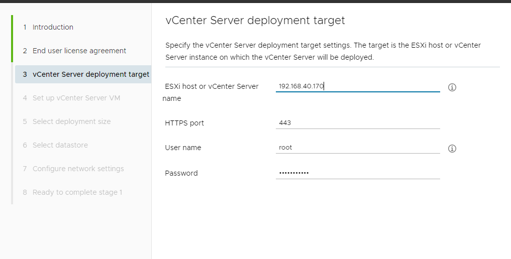

#### 3.3 Set Up Appliance VM

1. Enter a **name** for the vCenter Server Appliance VM.
2. Set and confirm a **root password**.
3. Click **Next**.

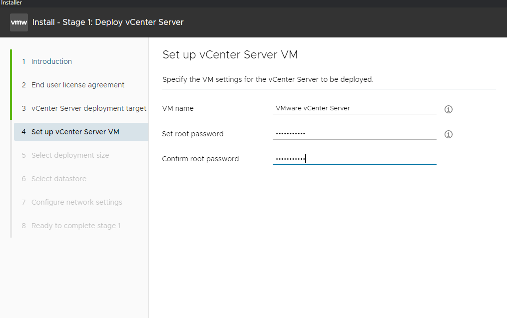

#### 3.4 Select Deployment Size

1. Choose an appropriate **deployment size** based on your environment needs. vCenter Server offers different deployment sizes to accommodate various environments, each with specific resource requirements. The available options are:
   - **Tiny**: Suitable for environments with up to 10 hosts and 100 virtual machines.
   - **Small**: Designed for environments with up to 100 hosts and 1,000 virtual machines.
   - **Medium**: Ideal for environments with up to 400 hosts and 4,000 virtual machines.
   - **Large**: For larger environments with up to 1,000 hosts and 10,000 virtual machines.
   - **X-Large**: Supports very large environments with up to 2,000 hosts and 35,000 virtual machines.

   > **Note**: For more details on each deployment size and guidance on selecting the best fit for your environment, refer to the course materials.   
   
   > **Note**: In this lab we will us only the Tiny size

2. Click **Next** to proceed with the selected deployment size.

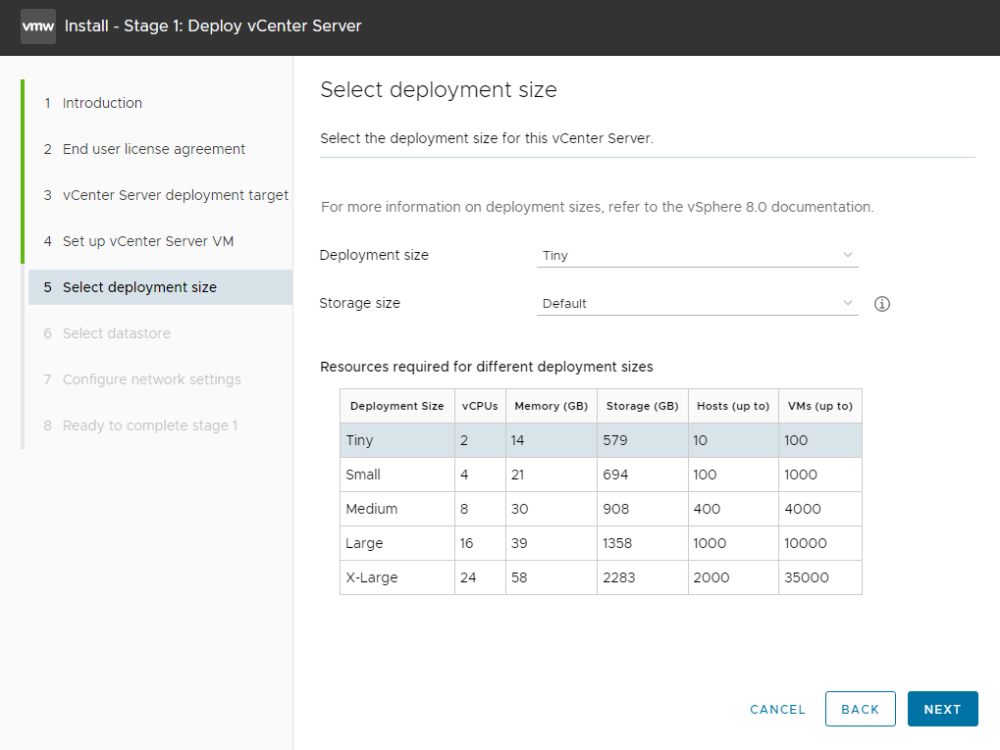

#### 3.5 Select Datastore

1. Select the **datastore** to host the vCenter Server Appliance.
2. Enable **thin disk mode** if you want to conserve disk space.
3. Click **Next**.

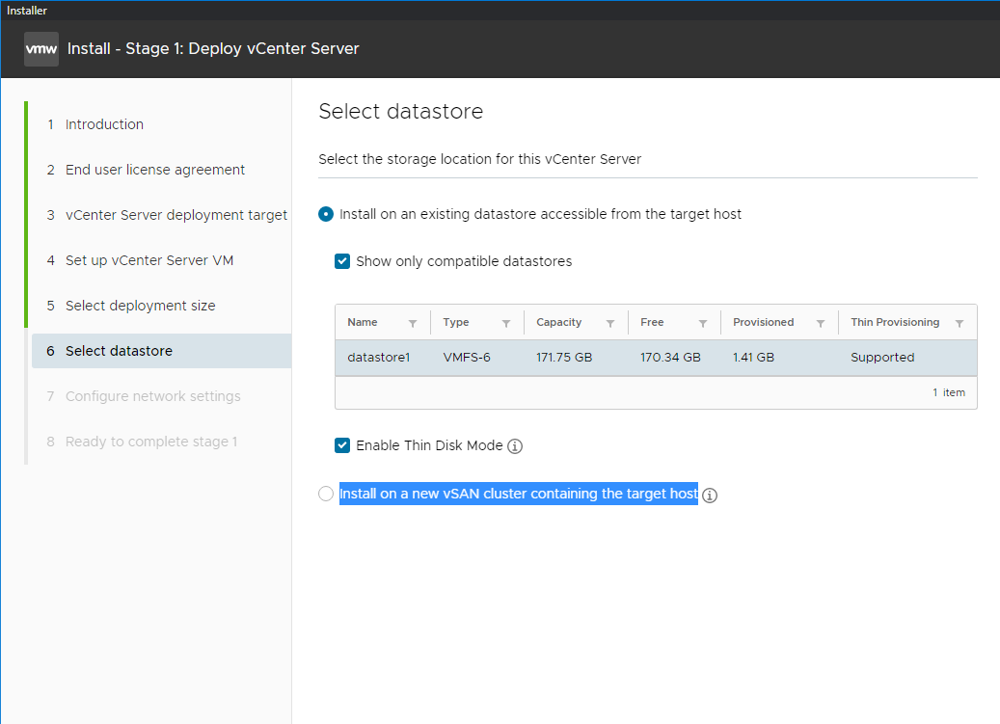

### Install on a New vSAN Cluster Containing the Target Host

The **"Install on a new vSAN cluster containing the target host"** option refers to setting up vCenter Server on a **vSAN (VMware vSphere Virtual SAN)** cluster that includes the target host for deployment.

#### Explanation

1. **vSAN Cluster Creation**: 
   - vSAN is VMware's software-defined storage solution integrated directly into the ESXi hypervisor. 
   - It combines local storage from multiple ESXi hosts in a cluster to create a distributed storage resource for virtual machines.
   - When creating a new vSAN cluster, you combine the storage resources of several hosts, providing shared storage across the cluster.

2. **Target Host Inclusion**:
   - The "target host" is the ESXi server on which vCenter Server is being deployed.
   - For this installation option, the target host must be a member of the vSAN cluster. 
   - This allows vCenter Server to use the vSAN datastore as its primary storage both during and after the installation.

3. **Deploying vCenter Server**:
   - By choosing this option, vCenter Server will be installed on a datastore within the newly created vSAN cluster.
   - This setup is commonly used in environments with hyperconverged infrastructure, simplifying storage management and providing high availability for vCenter Server without requiring traditional SAN or NAS storage.

#### Benefits

- **High Availability**: vSAN offers built-in redundancy and fault tolerance, ensuring that vCenter Server remains operational even if individual hosts or drives fail.
- **Scalability**: The vSAN cluster can be scaled by adding more hosts, providing additional storage and compute resources for the vCenter environment.
- **Simplified Management**: vSAN simplifies storage management by eliminating the need for external storage hardware, ideal for streamlined data center environments.

> **Note**: This deployment option is often chosen in advanced, high-availability environments or hyperconverged setups where vSAN is used for efficient, resilient storage.

#### 3.6 Configure Network Settings

1. Select the **network** for the vCenter Server to connect to.
2. Choose **IP allocation method** (DHCP or Static).
3. If using a static IP, enter the IP address, subnet mask, gateway, and DNS servers.
4. Click **Next**.

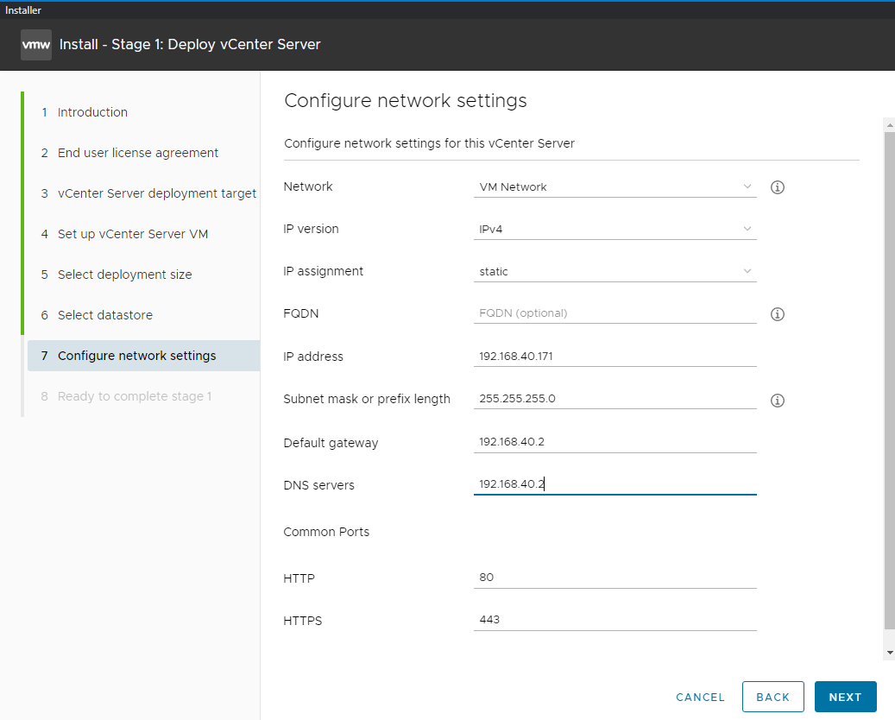

#### 3.7 Complete Deployment

1. Review the configuration summary and click **Finish** to begin the deployment.

> **Note**: Deployment may take a few minutes.

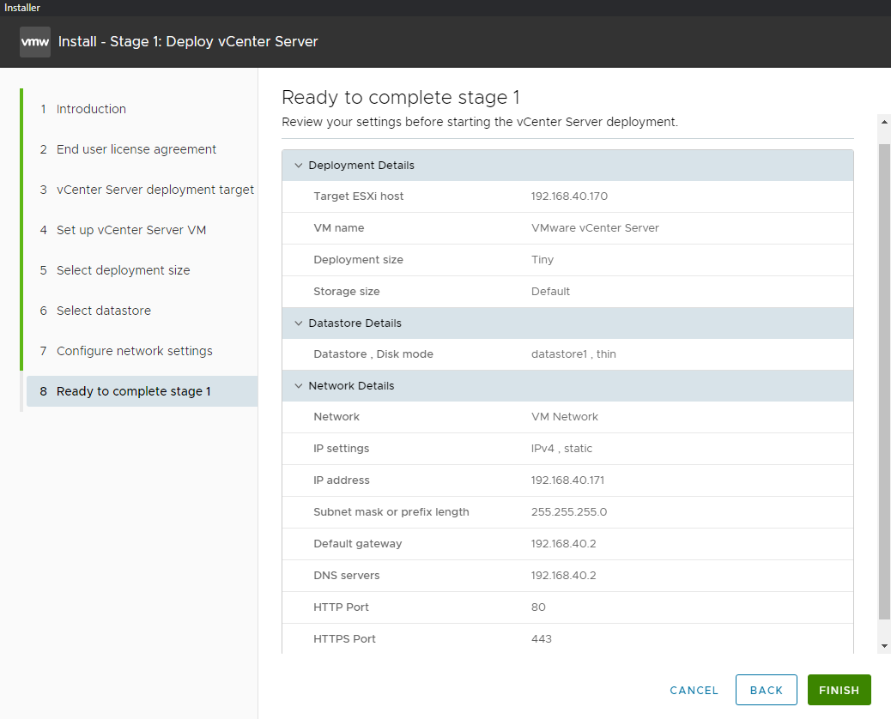

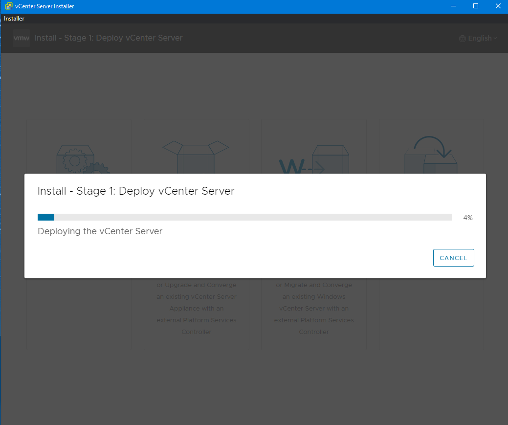

### Step 4: Stage 2 - Configure vCenter Server Appliance

#### 4.1 Begin Configuration

Once Stage 1 completes, click **Continue** to proceed to Stage 2 configuration.

#### 4.2 Configure Time Synchronization and NTP

1. Choose whether to synchronize time with the **ESXi host** or use an **NTP server**.
2. If using NTP, enter the NTP server details.
3. Click **Next**.

### 4.2 Configure Time Synchronization and NTP

In this lab, you will configure time synchronization for your **ESXi host**. Follow the steps below to complete the configuration.

1. **Choose Time Synchronization Method:**
   - Select whether you want to synchronize the time with the **ESXi host** or use an **NTP server**. 
   - **Option 1:** Sync with the ESXi host time.
   - **Option 2:** Use an NTP server for time synchronization.

2. **If using NTP:**
   - Enter the **NTP server** details. Make sure to input the correct NTP server address (e.g., `time.nist.gov`).

3. **Activate SSH (optional):**
   - If you want to activate SSH for remote management or troubleshooting, ensure that SSH access is enabled on the ESXi host.
   - To enable SSH later, go to **Host** > **Actions** > **Services** > **Enable Secure Shell (SSH)**.
   
4. **Proceed:**
   - After configuring the time synchronization and optional SSH settings, click **Next** to save your changes and continue.

#### 4.3 Set Up Single Sign-On (SSO)

1. **Choose Single Sign-On (SSO) Domain Setup:**
   - You will need to choose whether to **create a new SSO domain** or **join an existing one**. 
     - **Create a New Domain:** If this is a fresh setup and you don’t have an existing domain, choose to create a new SSO domain.
     - **Join an Existing Domain:** If you're integrating with an existing vSphere environment that already has an SSO domain, choose to join the existing domain.

2. **Create a New Domain:**
   - If you are creating a new domain, you will need to provide the following details:
     - **Domain Name:** Enter a unique name for the SSO domain. For example, you might use `vsphere.local` (a common default domain name).
     - **Administrator Password:** Set a strong password for the SSO administrator account. This account will have full administrative access to the SSO domain and its services.

3. **Click Next:**
   - After entering the required domain information, click **Next** to proceed with the configuration.
   - This will set up the SSO domain and allow you to manage authentication across your vSphere environment.

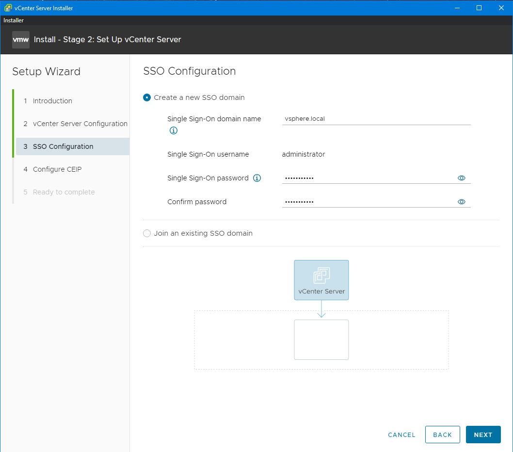

#### 4.4 Enable Telemetry (Optional)

1. Choose whether to participate in the **Customer Experience Improvement Program (CEIP)**.
2. Click **Next**.

#### 4.5 Review Configuration

1. Review the settings summary.
2. Click **Finish** to complete the configuration.

> **Note**: The configuration will take a few minutes. Once completed, a confirmation screen will appear.

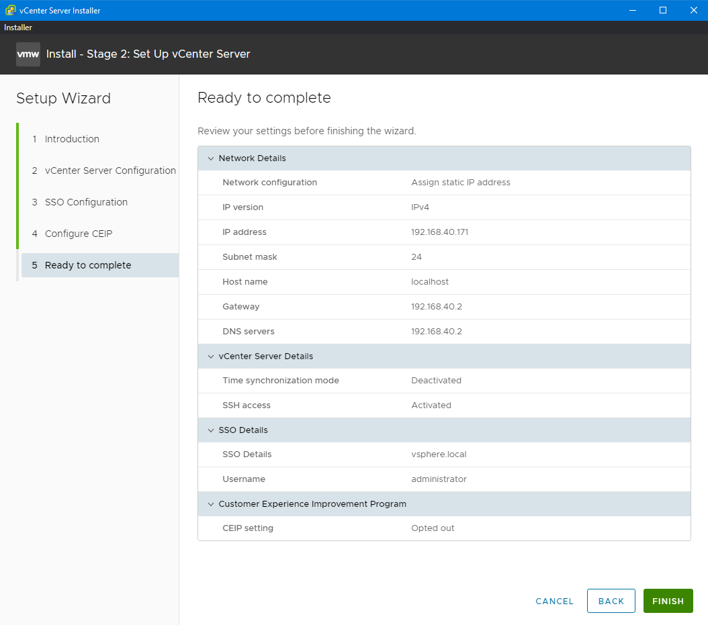

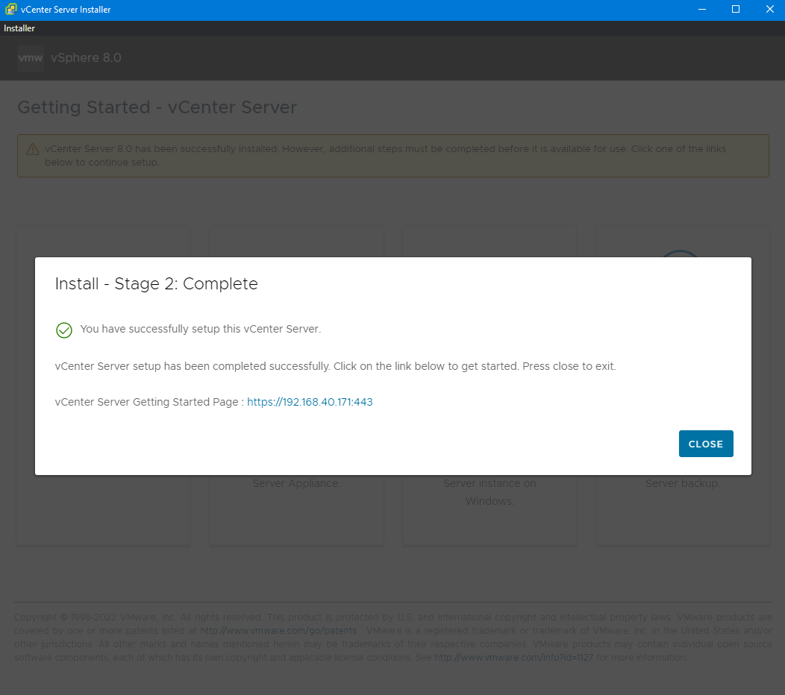

### Step 5: Access and Initial Configuration of vCenter

In this step, you'll access the **vCenter Server** and perform some initial configuration tasks to get started with managing your vSphere environment.

#### 1. Access the vCenter Server
- Open a web browser and navigate to the vCenter Server login page by entering the following URL:### Step 5: Access and Initial Configuration of vCenter

In this step, you'll access the **vCenter Server** and perform some initial configuration tasks to get started with managing your vSphere environment.

#### 1. Access the vCenter Server
- Open a web browser and navigate to the vCenter Server login page by entering the following URL: https://<vcenter-server-ip-or-fqdn>/ui

Replace `<vcenter-server-ip-or-fqdn>` with the actual IP address or fully qualified domain name (FQDN) of your vCenter Server.

#### 2. Log in with SSO Administrator Credentials
- Once the login page loads, enter the **SSO administrator credentials** you created earlier during the **Single Sign-On (SSO)** setup.
- **Username:** `administrator@vsphere.local`
- **Password:** Enter the password you set for the **SSO administrator**.

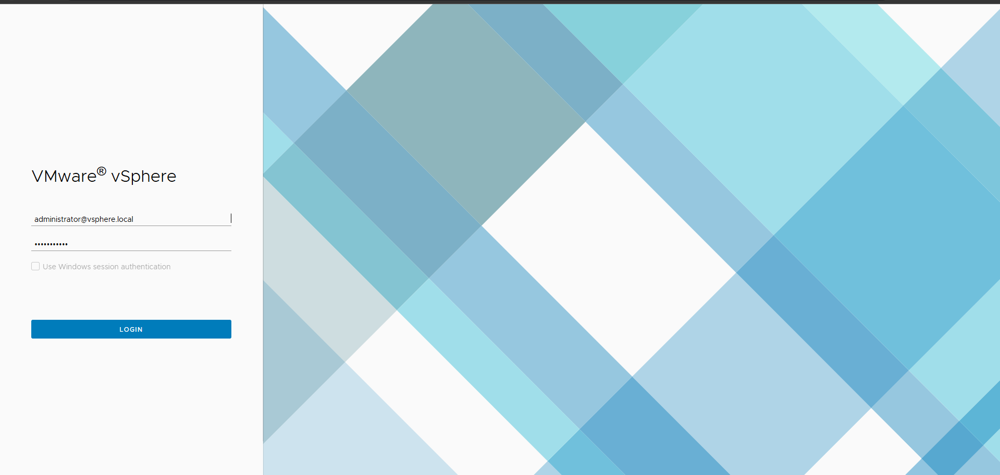

### Step 6: Perform Initial Configuration Tasks

After logging in successfully to your vCenter Server, you will access the vCenter interface. Follow these initial configuration steps to set up your environment for management.

#### 1. Create a New Datacenter
- Begin by creating a **new datacenter** to organize your resources.
- In the vCenter interface, navigate to the **Hosts and Clusters** view.
- Right-click on the root node (or select **New Datacenter** from the toolbar).
- Provide a name for the datacenter (e.g., `Datacenter1`), and click **OK** to create the datacenter.

#### 2. Create a New Cluster
- After creating the datacenter, create a **new cluster** within that datacenter.
- Right-click the newly created datacenter and select **New Cluster**.
- Provide a name for the cluster (e.g., `Cluster1`), and configure any other settings like **DRS** (Distributed Resource Scheduler) and **HA** (High Availability) based on your environment’s requirements.
- Click **OK** to create the cluster.

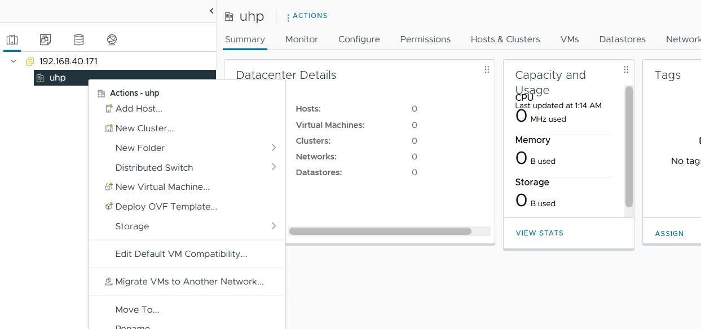

#### 2. Add ESXi Hosts to vCenter
- After creating the datacenter, you can start adding **ESXi hosts**.
- In the **Hosts and Clusters** view, select the datacenter you just created.
- Right-click the datacenter and choose **Add Host**.
- Enter the IP address or FQDN of the **ESXi host** you want to add.
- Follow the prompts to complete the process of adding the host, providing the correct credentials for the ESXi host.
- Repeat the process to add more ESXi hosts as needed.

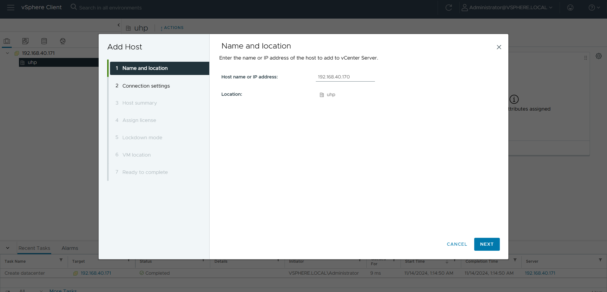

#### 3.Lockdown Mode

Lockdown Mode is a security feature for **ESXi hosts** that restricts remote access to the host. When enabled, only specific authorized methods can access the host, adding an extra layer of security to the environment.

**Options for Lockdown Mode**
When configuring lockdown mode on an ESXi host, you have the following options:

- **Disabled**  
  Lockdown mode is turned off, allowing remote users to log in to the host directly if they have the necessary credentials. This is the default setting.

- **Normal**  
  In Normal mode, the host is accessible only through:
  - **Local console**: Directly through a physical console or terminal attached to the host.
  - **vCenter Server**: Through centralized management using vCenter.
  
  This mode restricts direct access to the ESXi host from remote locations, requiring users to access the host through a centralized management tool or directly at the local console.

- **Strict**  
  In Strict mode, the host can only be accessed through **vCenter Server**. All other access methods, including the Direct Console User Interface (DCUI), are disabled, and the DCUI service is stopped. This mode provides the highest level of security by requiring all host management to be performed through vCenter.

> **Note**: If you are unsure whether to enable lockdown mode, it’s best to leave it **disabled**. You can configure lockdown mode later by editing the **Security Profile** in the host settings.

### Summary
| Lockdown Mode Option | Description |
|----------------------|-------------|
| **Disabled**         | No restrictions on remote access to the host. |
| **Normal**           | Access restricted to local console and vCenter Server only. |
| **Strict**           | Access restricted to vCenter Server only; DCUI service stopped. |

---

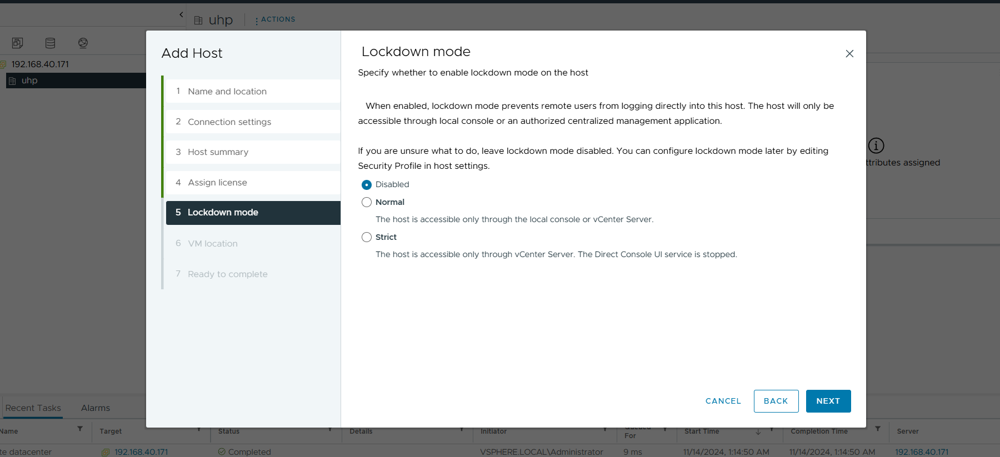

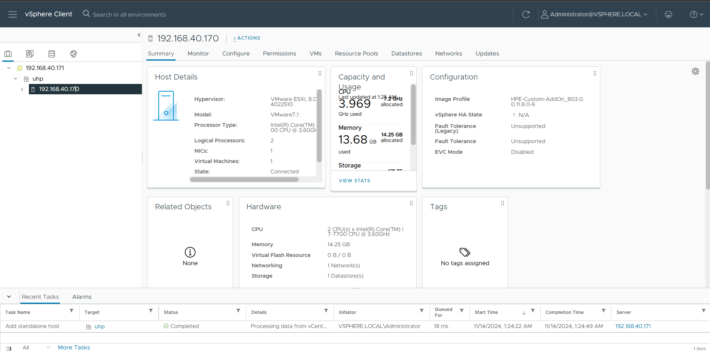
